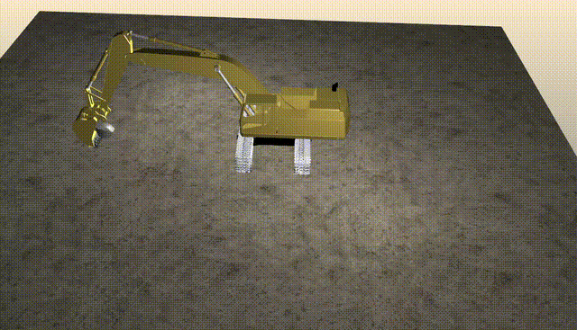

# RL Rock Capturing CAT365


# Automatic Rock Capturing using excavator CAT365 based on Reinforcement Learning (RL)

This project implements Reinforcement Learning (RL) for a rock capturing task using the **Excavator CAT365** model in the **AGX Dynamics** simulator. The goal is to develop and evaluate control policies capable of autonomously operating the excavator to capture rocks.

## Project Overview

- **Simulator**: [AGX Dynamics](https://www.algoryx.se/agx-dynamics/) by Algoryx Simulation AB
- **Excavator Model**: Excavator CAT365
- **Control Algorithm**: Reinforcement Learning (Stable-Baselines3)
- **Task**: Automatic rock capturing
- **Environment**: Custom AGX-Gym environment with excavator, terrain and rock assets

## Repository Structure

```text
project/
├── agxGym/                        # Gym environment and simulation wrappers
│   ├── envs/                      # Custom environments (excavator, wheelloader, etc.)
│   ├── models/                    # Simulation models (terrain, agents, sensors)
│   └── baselines_utils.py        # RL utility functions and wrappers
├── excavator365_RockCapturing.py   # Main training script
├── run_env.py                     # Manual control script for testing environment
├── results/                       # TensorBoard logs and training results
├── Others/                        # Old plots, policies, reward function notes
├── plot_training_data.py          # Script to plot training metrics
├── plot_evaluation_data.py        # Script to plot evaluation results
└── README.md                      # Project description and usage guide
```

## Features

- AGX simulation integration with RL pipeline
- Reward shaping for efficient rock capturing
- Logging with TensorBoard and performance monitoring
- Support for training reproducibility and evaluation

## System Requirements

- Operating System: Ubuntu 22.04 (Linux)
- CPU: Intel Xeon E5-1650 v2 @ 3.50GHz
- GPU Model: NVIDIA GeForce RTX 4070
- Python Version: 3.10
- Conda: Yes (using conda environment for package management) 
- AGX Dynamics (version: 2.39.0.0)
- Libraries: Gymnasium, Stable-Baselines3, NumPy, PyTorch, etc.

## Getting Started

Follow these steps to set up the project on your machine.

### 1. Clone the repository

```bash
git clone https://git.algoryx.se/algoryx/external/xscave/rl-rock-capturing-cat365.git
```

### 2. Create and activate a Conda environment

You can install dependencies via:

```bash
conda env create -f environment.yml
conda activate rlagx
```

### 3. Test environment manually via keyboard input
You can manually operate the excavator and test the environment using:

```bash
python run_env.py
```

### 4. Train using PPO

You can train a PPO againt using:

```bash
python excavator365_RockCapturing.py
```

### 5. Monitor Training with TensorBoard

To monitor the training process and visualize the results, you can use TensorBoard:

```bash
tensorboard --logdir results/excavator365-RockCapturing
```

## Visuals

You can convert *.webm to a GIF using ffmpeg in Linux:
```bash
sudo apt install ffmpeg
ffmpeg -i Video_Sample_Rock_Capturing.webm -vf "scale=640:-1:flags=lanczos" -c:v gif Video_Sample_Rock_Capturing.gif
```
Below is a sample video demonstrating the rock capturing process:



## Contributing

We welcome contributions to improve and extend this project. To contribute via GitLab, please follow the steps below:

1. **Fork** this repository to your own GitLab account.

2. **Clone** the forked repository to your local machine:
   ```bash
   git clone https://gitlab.com/your-username/rl-rock-capturing-cat365.git
   ```
3. Create a new branch for your feature or bug fix:
   ```bash
   git checkout -b feature/your-feature-name
   ```
4. Make your changes and commit them with a clear message:
   ```bash
   git add .
   git commit -m "Add: meaningful description of your change"
   ```
5. Push your changes to your fork:
   ```bash
   git push origin feature/your-feature-name
   ```
6. Create a Merge Request (MR) to the main repository on GitLab.

7. Wait for review, and respond to any requested changes.

## Authors and acknowledgment
This project is developed and maintained by:

- **Amirmasoud Molaei**  
  Email: [amirmasoud.molaei@tuni.fi](mailto:amirmasoud.molaei@tuni.fi)

Special thanks to the following contributors:

- Algoryx Simulation for providing the AGX Dynamics simulator
- Open-source community contributors to the Gymnasium and Stable-Baselines3 libraries, whose work was instrumental in the development of this project

We also thank everyone who has contributed to improving this project.

## License
This project is currently closed-source for internal research. Licensing terms will be defined in a future release.

## Project status
This project is part of the research project XSCAVE (https://www.xscave.eu/). We are planning to publish our work in the Automation in Construction journal (https://www.sciencedirect.com/journal/automation-in-construction).